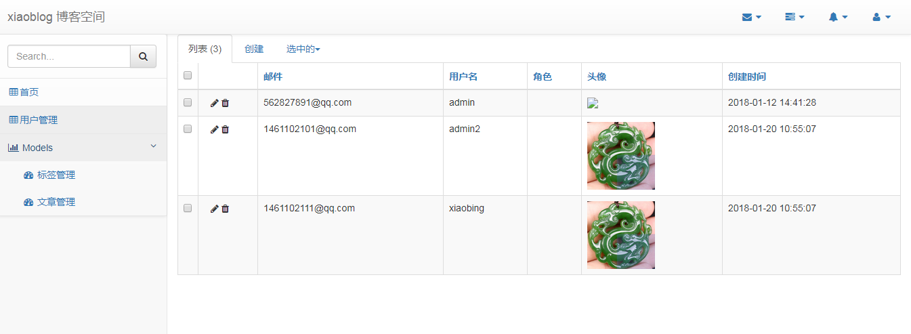

### Blog相关界面 
----

#### 管理后台


----

#### 首页


----

#### 文章详情页


----

### Linux环境下安装指导

> 安装环境：Flask+Gunicorn+Nginx 

#### 安装Nginx

第一步：下载nginx安装源

 ```
 rpm -ivh http://nginx.org/packages/centos/6/noarch/RPMS/nginx-release-centos-6-0.el6.ngx.noarch.rpm
 ```

第二步：安装nginx
```
yum install nginx
```

第三步：修改相关配置文件信息

配置文件集中在：``/etc/nginx/nginx.conf`` 目录中

默认的配置在 ``/ect/nginx/conf.d/default.conf``
你可以在default里修改，也可以直接在ngnix.conf 里添加配置

第四步：启动服务、关闭

##### 启动命令    
```
service nginx start 
```
   
##### 停止命令    
```
service nginx stop 
```
   
##### 重启命令    
```
service nginx restart 
```
----

####  Gunicorn安装

第一步：安装：
```
pip install gunicorn==19.7.1
```
    
第二步：配置启动
```
gunicorn [options] module_name:variable_name
```
    
启动类为：
 ```python
 #esayblog.py
 from flask import Flask
 app = Flask(__name__)

 if __name__ == '__main__':
    app.wsgi_app = ProxyFix(app.wsgi_app)
    app.run()
 ```

 则命令为：
 ```
   gunicorn -w 3 esayblog:app -b 0.0.0.0:8080
  ```

 -w :线程数

 -b: 指定ip和端口

 在linux，外网可访问必须配 0.0.0.0:port

##### 配置nginx的代理服务：
直接在default.conf 里修改了
```python
   server {
        listen 80;
        server_name _; # 外部地址

        location / {
                proxy_pass http://127.0.0.1:8000;
                proxy_redirect     off;
                proxy_set_header   Host                 $http_host;
                proxy_set_header   X-Real-IP            $remote_addr;
                proxy_set_header   X-Forwarded-For      $proxy_add_x_forwarded_for;
                proxy_set_header   X-Forwarded-Proto    $scheme;
        }
```

##### 测试访问

http://ip:8000/index.html
http://ip.8080/index.html

比较一下 请求的消息头信息有什么区别

##### 重启 gunicorn
+ pstree -ap|grep gunicorn

+ kill -HUP 30080
